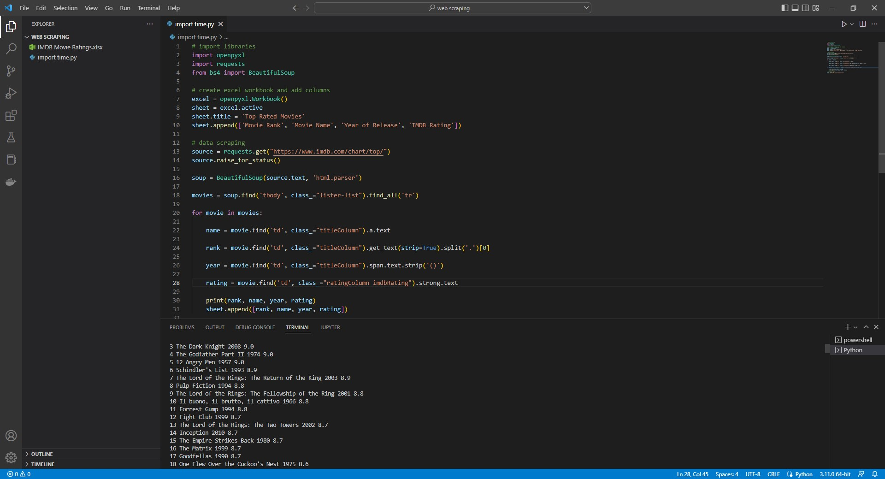
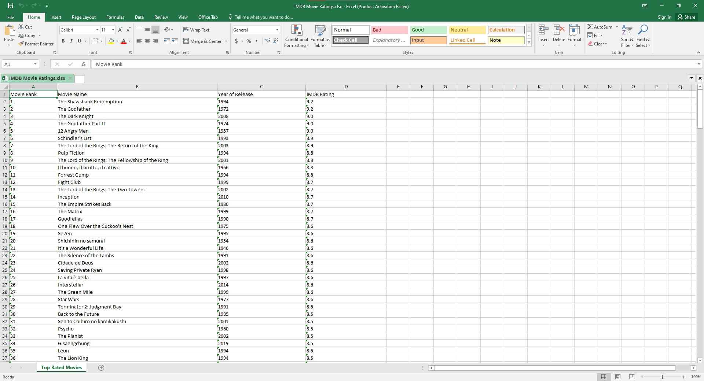

# Python Web Scraping 

Web Scraping is the process of programmatically extracting data from a website. Python supports several simple to use libraries like Beautiful Soup and Requests, which can be used to extract data from any website. Requests module is used to access the desired website while Beautiful Soup module is used to parse the HTML source code of that website. Beautiful Soup makes it very easy to parse HTML content and then provides multiple methods that can be used to extract the data from any HTML tags. 

The following code crawls the IMDB website, retrieves the highest rated films that are listed there, and then loads this information into an excel file.

In order to load data into an Excel file, we will be using the openpyxl module. Using openpyxl, it is very easy to create a new excel file, rename the sheet, and then load data into the excel file.

## Libraries
* Requests
* BeautifulSoup
* Openpyxl

## Requirements
* VS Code
* Python

## Code 

* [Code](code/web_scraping.py)

